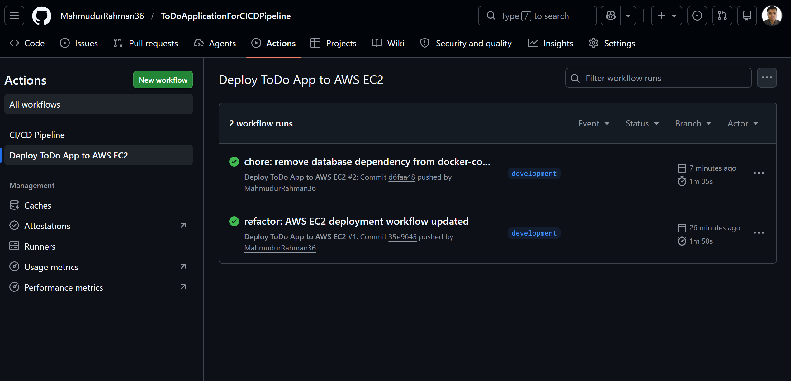
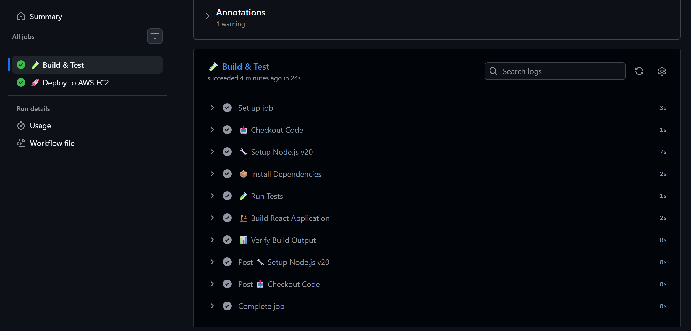
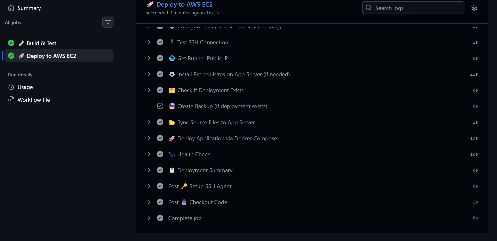
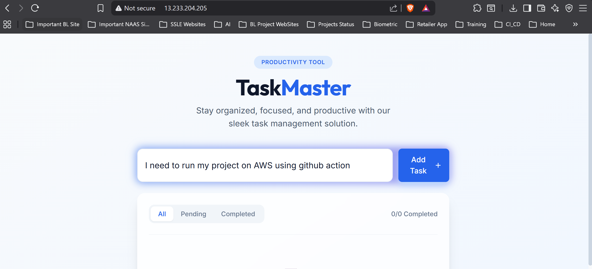
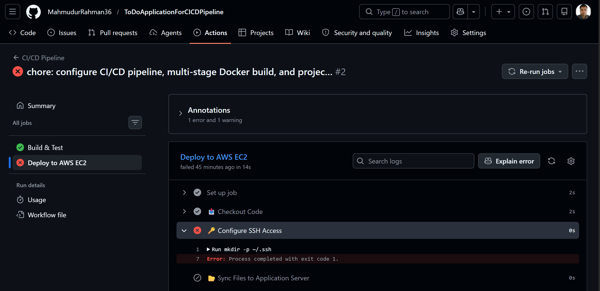

# 🚀 GitHub Actions CI/CD Pipeline — ToDo Application


This document describes the complete CI/CD pipeline implemented for the **ToDo Application** — a React-based frontend deployed on AWS EC2 using GitHub Actions, Docker, and Nginx.

---

## 📋 Table of Contents

1. [Key Concepts](#-key-concepts)
   - [What is CI/CD?](#what-is-cicd)
   - [What is a Self-Hosted Runner?](#what-is-a-self-hosted-runner)
   - [Workflow Execution Process](#workflow-execution-process)
2. [Infrastructure Overview](#-infrastructure-overview)
3. [Pipeline Architecture](#-pipeline-architecture)
4. [Pipeline in Action](#-pipeline-in-action)
   - [Successful Execution](#1-successful-pipeline-execution)
   - [Live Application](#2-application-running-on-ec2)
   - [Debugging Failures](#3-debugging-a-failed-pipeline)

---

## 📘 Key Concepts

### What is CI/CD?

**CI/CD** stands for **Continuous Integration** and **Continuous Deployment** — a set of practices that automate the software delivery process.

| Term | Full Form | What it Does |
|---|---|---|
| **CI** | Continuous Integration | Automatically builds and tests code every time a developer pushes a change, catching bugs early before they reach production. |
| **CD** | Continuous Deployment | Automatically releases every build that passes all tests directly to the production environment — without manual intervention. |

**Why CI/CD matters:**
- ✅ Eliminates manual, error-prone build and deployment steps
- ✅ Provides instant feedback on broken code via automated tests
- ✅ Ensures every deployment is consistent and reproducible
- ✅ Reduces time-to-production from hours/days to minutes

In this project, every `git push` to the `development` branch automatically:
1. Installs dependencies
2. Runs tests
3. Builds the React application
4. Deploys the Docker container to EC2
5. Verifies the app is healthy

---

### What is a Self-Hosted Runner?

A **self-hosted runner** is a machine you own and manage that executes GitHub Actions jobs — as opposed to the disposable VMs GitHub provides by default.

**Comparison:**

| Feature | GitHub-Hosted Runner | Self-Hosted Runner (this project) |
|---|---|---|
| Managed by | GitHub | You (on AWS EC2) |
| Cost | Free tier limited | Pay for EC2 instance |
| Hardware control | ❌ Fixed specs | ✅ Choose instance size |
| Persistent storage | ❌ Fresh each run | ✅ Files persist between runs |
| Private network access | ❌ No | ✅ Can access internal AWS VPC |
| Custom software | ❌ Limited | ✅ Pre-install anything |

**In this project**, the runner runs on `mahmud-batch11-selfhosted-runner` (`65.0.94.198`). It:
- Picks up jobs from GitHub via a long-poll connection
- Runs all build and deploy steps locally
- SSH's into the application server to trigger Docker deployments

**How to register a self-hosted runner:**
```bash
# On the runner server
mkdir actions-runner && cd actions-runner
curl -o actions-runner-linux-x64.tar.gz -L https://github.com/actions/runner/releases/download/v2.x.x/actions-runner-linux-x64.tar.gz
tar xzf ./actions-runner-linux-x64.tar.gz
./config.sh --url https://github.com/<your-org>/<your-repo> --token <TOKEN>
./run.sh
```

---

### Workflow Execution Process

When a developer pushes code to the `development` branch, the following sequence runs automatically:

```
Developer pushes code
        │
        ▼
┌──────────────────────┐
│   GitHub receives    │
│   the push event     │
└──────────┬───────────┘
           │  triggers
           ▼
┌──────────────────────┐
│  Self-hosted runner  │  ← mahmud-batch11-selfhosted-runner
│  picks up the job    │
└──────────┬───────────┘
           │
           ▼
┌──────────────────────────────────────────┐
│  JOB 1: 🧪 Build & Test                 │
│  ├─ Checkout code                        │
│  ├─ Setup Node.js 20                     │
│  ├─ npm ci (install dependencies)        │
│  ├─ npm test (run vitest)                │
│  ├─ npm run build (Vite production build)│
│  └─ Verify dist/ output                 │
└──────────┬───────────────────────────────┘
           │  on success
           ▼
┌──────────────────────────────────────────┐
│  JOB 2: 🚀 Deploy to EC2                │
│  ├─ Setup SSH Agent (EC2_SSH_KEY secret) │
│  ├─ Test SSH connection to app server    │
│  ├─ Install Docker on app server (once) │
│  ├─ Backup existing deployment           │
│  ├─ rsync project files to app server   │
│  ├─ docker compose build                │
│  ├─ docker compose up -d                │
│  ├─ Health check (curl localhost:80)    │
│  └─ Post deployment summary             │
└──────────────────────────────────────────┘
           │
           ▼
   ✅ App live at http://13.233.204.205
```

**Required GitHub Secrets:**

| Secret | Purpose |
|---|---|
| `EC2_HOST` | Public IP of the application server (`13.233.204.205`) |
| `EC2_USER` | SSH username (`ubuntu`) |
| `EC2_SSH_KEY` | Private key to SSH into the application server |

---

## 🏗️ Infrastructure Overview

The deployment uses **two separate AWS EC2 instances** running Ubuntu 24.04:

| Server Name | Role | Public IP | Private IP |
|---|---|---|---|
| `mahmud-batch11-selfhosted-runner` | Runs the GitHub Actions workflow | `65.0.94.198` | `10.0.5.250` |
| `mahmud-batch11-application` | Hosts the React app, Docker & Nginx | `13.233.204.205` | `10.0.8.97` |

> **Why two servers?**
> Separating the CI runner from the production environment is a security best practice. The runner server never directly exposes the application — it only SSH's into the application server to trigger deployments.

---

## 🔄 Pipeline Architecture


```
┌─────────────────────────────────────────────────────────────────┐
│                        GitHub Repository                        │
│                  branch: development                            │
└────────────────────────────┬────────────────────────────────────┘
                             │ git push
                             ▼
┌─────────────────────────────────────────────────────────────────┐
│             Self-Hosted Runner (65.0.94.198)                    │
│         mahmud-batch11-selfhosted-runner                        │
│                                                                 │
│  ┌─────────────────────┐    ┌───────────────────────────────┐  │
│  │  Job 1: CI          │───▶│  Job 2: CD                    │  │
│  │  • Install deps     │    │  • SSH into app server        │  │
│  │  • Run tests        │    │  • rsync source files         │  │
│  │  • Build React app  │    │  • docker compose up          │  │
│  └─────────────────────┘    │  • Health check               │  │
│                             └───────────────┬───────────────┘  │
└─────────────────────────────────────────────│───────────────────┘
                                              │ SSH deploy
                                              ▼
┌─────────────────────────────────────────────────────────────────┐
│             Application Server (13.233.204.205)                 │
│                 mahmud-batch11-application                      │
│                                                                 │
│   ┌──────────────────────────────────────────────────────┐     │
│   │  Docker Engine                                       │     │
│   │  ┌────────────────────────────────────────────────┐  │     │
│   │  │  todo_app container                            │  │     │
│   │  │  • Nginx serving React build on port 80        │  │     │
│   │  └────────────────────────────────────────────────┘  │     │
│   └──────────────────────────────────────────────────────┘     │
│                          Port 80 (HTTP) → Internet              │
└─────────────────────────────────────────────────────────────────┘
```

---

## 📸 Pipeline in Action

### 1. Successful Pipeline Execution

When all stages pass, the GitHub Actions dashboard shows a complete green workflow with both jobs succeeding.



*Figure 1: Full CI/CD pipeline overview — both Build & Test and Deploy jobs completed successfully.*

---



*Figure 2: Build & Test job detail — Node.js setup, dependency install, test run, and Vite production build all passed.*

---



*Figure 3: Deploy job detail — SSH connection, Docker image build, container startup, and health check all passed.*

---

### 2. Application Running on EC2

After a successful deployment, the ToDo application is accessible at `http://13.233.204.205`.



*Figure 4: The ToDo application live on the AWS EC2 application server, served by Nginx inside Docker.*

---

### 3. Debugging a Failed Pipeline

If any step fails, GitHub Actions logs the exact error with the step name, command output, and exit code — making it easy to identify and fix the problem.



*Figure 5: Example of a failed pipeline run — the expanded step log shows the precise error (e.g., missing secret, test failure, or SSH timeout) that caused the job to stop.*

**Common failure causes and fixes:**

| Failure | Likely Cause | Fix |
|---|---|---|
| `ssh-private-key argument is empty` | `EC2_SSH_KEY` secret not set | Add secret in repo Settings → Secrets |
| `SSH connection refused` | Wrong IP in `EC2_HOST` or port 22 blocked | Check Security Group inbound rules |
| `npm test failed` | A test assertion failed | Fix the failing test in source code |
| `docker: command not found` | Docker not installed on app server | Re-run pipeline — prerequisites step will install it |
| `HTTP 000` in health check | Container crashed on startup | Check `docker compose logs` on the app server |
